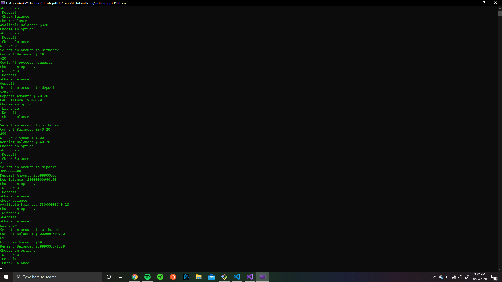

# Lab02

## The Problem Domain
+ Create a bank “ATM” program within a console application
### Program Specifications
Using Test Driven Development, build out a console application that mocks the functionality of an ATM. Your solution should include the following methods:

### Main method
+ Call the user interface method to activate the application
+ Testable external methods:
### ViewBalance()
+ Functionality: Returns the value of the current balance
+ Return: decimal
+ Test to ensure that the balance properly shows the correct amount after each transaction
### Withdraw()
+ Functionality: Subtracts money from the balance
+ Return: decimal
+ Do not allow the user to withdraw more money than what’s available.
+ Do not allow the user to withdraw a value less than zero.
### Deposit()
+ Return: decimal
+ Functionality: Adds money to the balance
+ Do not allow the user to deposit a negative amount
+ Variable to hold the current Balance of the account.
+ Make this a static public decimal Balance variable, declared above the Main() method. This will allow you to access the Balance variable anywhere in this Program.cs file.